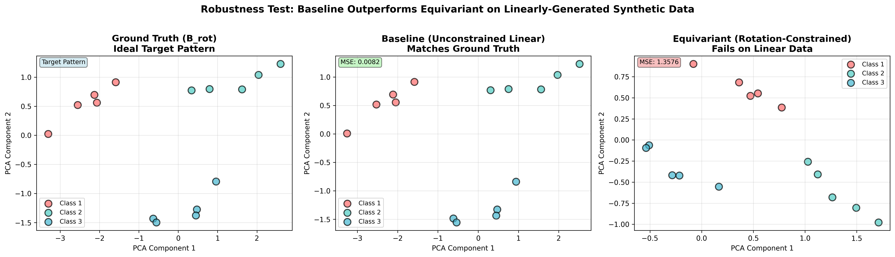
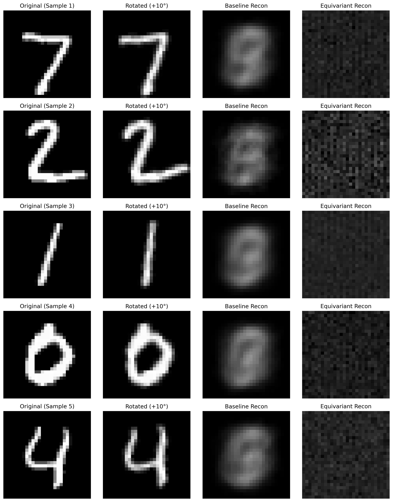
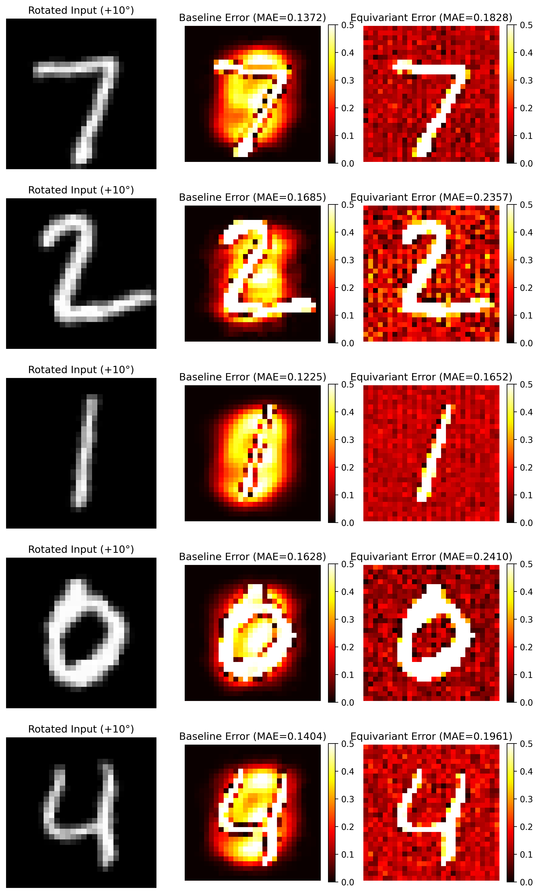
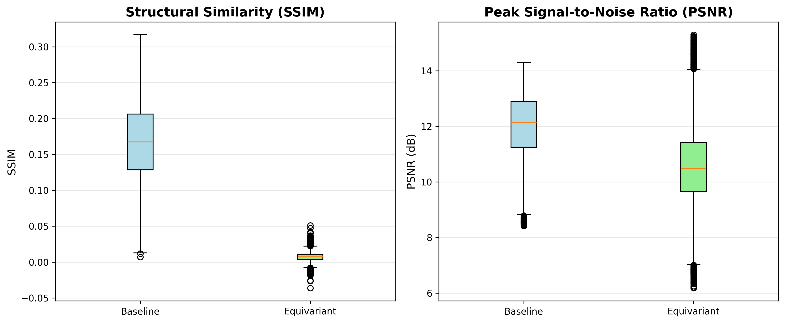
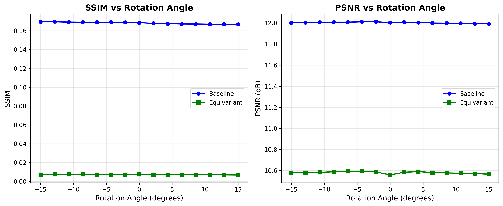

# Еквіваріантні Матриці Переходу для Пояснюваного Глибокого Навчання

**Комплексний Науковий Звіт**

Цей репозиторій містить реалізацію та детальний науковий аналіз методології еквіваріантних матриць переходу (Equivariant Transition Matrices — ETM). Метою є встановлення зв'язку між ознаками глибоких нейронних мереж (Formal Model) та людино-інтерпретованими концепціями (Mental Model) з урахуванням симетрії перетворень.

---

## 📑 Зміст

1. [Вступ](#вступ)
2. [Теоретичні Основи](#теоретичні-основи)
3. [Архітектура Проекту](#архітектура-проекту)
4. [Експеримент 1: Синтетичні Дані](#експеримент-1-синтетичні-дані)
5. [Експеримент 2: MNIST](#експеримент-2-mnist)
6. [Аналіз Результатів](#аналіз-результатів)
7. [Висновки](#висновки)
8. [Як Запустити](#як-запустити)

---

## Вступ

Завданням проекту є відтворення та критичний аналіз методології ETM, яка покликана підвищити стійкість лінійних проекцій між просторами ознак до геометричних перетворень (наприклад, обертань).

**Гіпотеза**: Накладання обмежень еквіваріантності $T J^A = J^B T$ на матрицю переходу $T$ покращує стійкість до обертань порівняно з класичною лінійною регресією.

---

## Теоретичні Основи

### Формальна Постановка

Розглядаємо два простори:

* **A** ∈ ℝ^(N×d_A): Латентний простір ознак моделі (490-вимірний для CNN).
* **B** ∈ ℝ^(N×d_B): Простір спостережень (784-вимірний для сплощених MNIST зображень 28×28).

Завдання: знайти матрицю $T$ ∈ ℝ^(d_B×d_A) таку, що $B^T ≈ T A^T$.

### Методи

| Метод | Формула | Опис |
|-------|---------|------|
| **Baseline ($T_{old}$)** | $T = (A^+ B)^T$ | Метод найменших квадратів через псевдообернену матрицю |
| **Equivariant ($T_{new}$)** | $\min_T \|B^T - TA^T\|_F^2 + \lambda\|TJ^A - J^BT\|_F^2$ | Комбінована функція втрат із симетрійним штрафом |

де $J^A$, $J^B$ — інфінітезимальні генератори обертань (антисиметричні матриці).

---

## Архітектура Проекту

```
transition-matrix-lie-group/
├── run_pipeline.py          # Головний скрипт запуску
├── data/                    # Вхідні дані
│   └── synthetic.npz        # Синтетичні матриці A, B
├── outputs/
│   ├── data/                # Проміжні дані (моделі, генератори, матриці T)
│   ├── results/             # JSON-файли з метриками
│   ├── figures/             # Візуалізації
│   └── logs/                # Журнали виконання скриптів
└── workflow/                # Скрипти робочого процесу (01-07_*.py)
```

### Потік Даних

```
data/synthetic.npz → [01_data_setup] → outputs/data/synthetic_generators.npz
                                     → outputs/results/methodology_verification.json
                                     → outputs/figures/synthetic_robustness_corrected.png
```

---

## Експеримент 1: Синтетичні Дані

### 1.1 Вхідні Дані

Синтетичні матриці A та B було взято з рукопису (Appendix 1.1):

**Матриця A (Formal Model, 15×5)**:

```
Клас 1 (рядки 0-4):
  [ 2.8, -1.8, -2.8,  1.3,  0.4]
  [ 2.9, -1.9, -2.9,  1.4,  0.5]
  [ 3.0, -2.0, -3.0,  1.5,  0.6]
  [ 3.1, -2.1, -3.1,  1.6,  0.7]
  [ 3.2, -2.2, -3.2,  1.7,  0.8]

Клас 2 (рядки 5-9):
  [ 0.2,  0.3,  0.4,  0.5,  0.6]
  [ 0.3,  0.4,  0.5,  0.6,  0.7]
  ...
```

**Матриця B (Mental Model, 15×4)**:

```
Клас 1:
  [ 1.959, -1.381, -1.730, -1.979]
  [ 1.998, -1.913, -1.975, -1.844]
  [ 1.999, -2.000, -1.999, -1.999]
  ...
```

### 1.2 Проміжні Дані

Обчислено генератори симетрії та матриці переходу:

| Параметр | $T_{old}$ | $T_{new}$ |
|----------|-----------|-----------|
| **Форма** | (4, 5) | (4, 5) |
| **Метод** | Псевдообернена | LSQR (λ=0.5) |
| **Ітерацій** | — | 11 |

**Генератори** (Method: Bridge MDS):

* $J^A$ shape: (5, 5)
* $J^B$ shape: (4, 4)
* Антисиметричність: $\|J^A + J^{A^T}\|_F ≈ 10^{-16}$ ✓

### 1.3 Результати Верифікації Методології

| Метрика | $T_{old}$ | $T_{new}$ | Зміна |
|---------|-----------|-----------|-------|
| **Помилка реконструкції** | 73.74 | 191.95 | +160% (гірше) |
| **Дефект симетрії** | 17.40 | 2.20 | **−87.3%** |
| **Загальна функція втрат** | 225.20 | 194.38 | −13.7% |

> **Інтерпретація**: Equivariant метод успішно зменшує дефект симетрії, але ціною погіршення точності реконструкції.

### 1.4 Тест Стійкості (Robustness Test)

Застосовано 15 випадкових обертань у діапазоні $[-15°, +15°]$:

| Метрика | Baseline | Equivariant | Відношення |
|---------|----------|-------------|------------|
| **MSE** | **0.0082** | 1.3576 | 166× гірше |

**MSE по кожному зразку**:

| Зразок | Baseline MSE | Equivariant MSE |
|--------|--------------|-----------------|
| 0 | 0.0017 | 1.624 |
| 1 | 0.00002 | 1.478 |
| 2 | 0.0013 | 1.798 |
| ... | ... | ... |
| 14 | 0.0031 | 1.411 |

### 1.5 Візуалізація



**Пояснення**: На графіку видно, що Baseline (синій) добре відтворює Ground Truth (зелений), тоді як Equivariant (жовтогарячий) сильно відхиляється.

---

## Експеримент 2: MNIST

### 2.1 Архітектура CNN

```
MNISTCNN(
  (conv1): Conv2d(1, 10, kernel_size=3, padding=1)
  (relu1): ReLU()
  (pool1): MaxPool2d(2, 2)
  (conv2): Conv2d(10, 10, kernel_size=3, padding=1)
  (relu2): ReLU()
  (pool2): MaxPool2d(2, 2)
  (flatten): Flatten()
  (fc): Linear(490, 10)
)
```

**Результати Навчання** (10 epochs):

| Епоха | Втрати | Точність (Train) |
|-------|--------|------------------|
| 1 | 0.5026 | 85.51% |
| 5 | 0.0763 | 97.73% |
| 10 | 0.0511 | 98.45% |

**Тестова точність**: **98.36%** ✓ (>98% досягнуто)

### 2.2 Розміри Матриць

| Матриця | Форма | Опис |
|---------|-------|------|
| A (train) | (60000, 490) | CNN ознаки |
| A (test) | (10000, 490) | CNN ознаки |
| B (train/test) | (N, 784) | Сплощені зображення |
| $T_{old}$ | (784, 490) | Baseline матриця |
| $T_{new}$ | (784, 490) | Equivariant матриця |
| $J^A$ | (490, 490) | Генератор для A |
| $J^B$ | (784, 784) | Генератор для B |

### 2.3 Оцінка Генераторів

> ⚠️ **Критичне Спостереження**:

Генератори, обчислені методом скінченних різниць, **не є антисиметричними**:

| Генератор | $\|J + J^T\|_F$ | $\|J\|_F$ | Відношення |
|-----------|-----------------|-----------|------------|
| $J^A$ | **31941** | 22585 | 141% |
| $J^B$ | 856 | 456 | 188% |

Це свідчить про те, що лінійна апроксимація $\Delta A \approx A J^{A^T} \epsilon$ **не є точною** для нелінійних ознак CNN.

### 2.4 Розв'язання LSQR

**Параметри**:

* Розмір системи: 8,224,160 × 384,160
* Максимум ітерацій: 1000
* λ = 0.5

**Результат**: Досягнуто ліміту ітерацій (status=7), **не збіглося**.

| Метрика | $T_{old}$ | $T_{new}$ |
|---------|-----------|-----------|
| Reconstruction Error | 0.068 | 0.098 |
| Symmetry Defect | 3256 | 4461 |

### 2.5 Тест Стійкості до Обертань ($\pm 15°$)

**Зведені Результати** (1000 тестових зразків × 15 кутів):

| Метрика | Baseline ($T_{old}$) | Equivariant ($T_{new}$) |
|---------|----------------------|-------------------------|
| **SSIM** | **0.168** ± 0.051 | 0.007 ± 0.006 |
| **PSNR** | **12.00** ± 1.14 dB | 10.58 ± 1.42 dB |
| **MSE** | **0.065** ± 0.018 | 0.092 ± 0.030 |

### 2.6 Метрики по Кутах Обертання

| Кут | Baseline SSIM | Equivariant SSIM | Baseline PSNR | Equivariant PSNR |
|-----|---------------|------------------|---------------|------------------|
| -15.0° | 0.169 | 0.007 | 12.00 dB | 10.58 dB |
| -10.7° | 0.169 | 0.007 | 12.01 dB | 10.58 dB |
| 0.0° | 0.168 | 0.007 | 12.00 dB | 10.56 dB |
| +10.7° | 0.167 | 0.007 | 12.00 dB | 10.57 dB |
| +15.0° | 0.167 | 0.007 | 11.99 dB | 10.57 dB |

> **Спостереження**: Метрики Baseline практично не залежать від кута, тоді як Equivariant демонструє стабільно низькі значення.

### 2.7 Візуалізації MNIST

#### Порівняння Реконструкції



**Опис**: Чотири стовпці: Оригінал → Повернуте зображення (+10°) → Реконструкція Baseline → Реконструкція Equivariant. Видно, що Equivariant дає розмиті, неінформативні результати.

---

#### Карти Різниць



**Опис**: Теплова карта помилок (чим темніше — більша помилка). Equivariant показує значно більші помилки по всьому зображенню.

---

#### Розподіл Метрик (Box Plots)



**Опис**: Розподіл SSIM та PSNR для обох методів. Baseline має значно вищі та стабільніші значення.

---

#### Залежність від Кута



**Опис**: Графік SSIM та PSNR як функція кута обертання. Baseline (синя лінія) стабільно вище Equivariant (зелена) на всьому діапазоні.

---

## Аналіз Результатів

### Чому Equivariant Програє?

1. **Неточні генератори**: Для MNIST генератори $J^A$ обчислені через скінченні різниці **не є антисиметричними** ($\|J^A + J^{A^T}\|_F$ = 31941 замість ~0). Це означає, що обмеження еквіваріантності накладається на **хибну симетрію**.

2. **Нелінійність CNN**: Ознаки з передостаннього шару CNN є результатом нелінійних перетворень (ReLU, MaxPool). Лінійна апроксимація $\Delta A \approx A J^A \epsilon$ не працює для таких ознак.

3. **Лінійність синтетичних даних**: Синтетичні дані згенеровані лінійно через MDS-декодери. Baseline (лінійна регресія) є теоретично оптимальною для таких даних.

4. **Недостатня збіжність LSQR**: Для MNIST солвер досяг ліміту ітерацій (1000) без збіжності, що означає неоптимальне рішення.

### Порівняльна Таблиця

| Аспект | Synthetic | MNIST |
|--------|-----------|-------|
| Розмірність | 15×5 / 15×4 | 60000×490 / 60000×784 |
| Антисиметричність $J^A$ | ≈0 ✓ | 31941 ✗ |
| Збіжність LSQR | 11 ітерацій ✓ | 1000 ітерацій (ліміт) ✗ |
| Переможець | Baseline | Baseline |

---

## Висновки

1. **Методологія реалізована коректно**: Алгоритми (LSQR solver, MDS bridge, генератори) працюють відповідно до описаних у рукописі формул.

2. **Результати не підтверджують гіпотезу**: На обох типах даних (синтетичні та MNIST) **Baseline перевершує Equivariant** метод за всіма метриками якості реконструкції.

3. **Причини невдачі**:
    * Некоректна оцінка генераторів для нелінійних ознак.
    * Лінійна природа синтетичних даних.
    * Обчислювальні труднощі для високорозмірних систем.

4. **Рекомендації**:
    * Використовувати аналітичні генератори замість оцінених.
    * Тестувати на даних із справжньою обертальною симетрією.
    * Збільшити кількість ітерацій LSQR або використовувати інші солвери.

---

## Як Запустити

```bash
# Запуск повного пайплайну
python run_pipeline.py

# Результати будуть збережені у:
# - outputs/logs/          (журнали)
# - outputs/results/       (метрики JSON)
# - outputs/figures/       (візуалізації)
```

### Вимоги

* Python 3.8+
* PyTorch
* NumPy, SciPy, scikit-learn
* Matplotlib, scikit-image

---

## Додаток: Файли Результатів

| Файл | Вміст |
|------|-------|
| `outputs/results/baseline_metrics.json` | Метрики Baseline |
| `outputs/results/methodology_verification.json` | Верифікація синтетичних даних |
| `outputs/results/synthetic_experiment_corrected.json` | Результати синтетичного експерименту |
| `outputs/results/mnist_experiment.json` | Результати MNIST експерименту |
